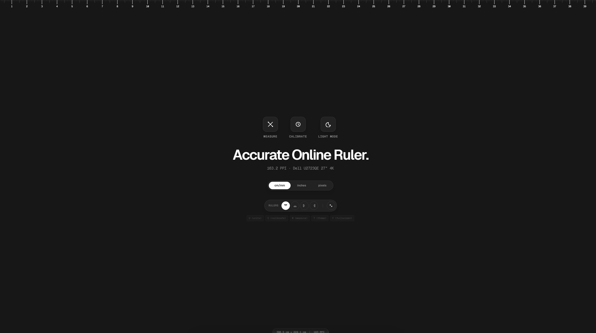

# Real Online Ruler - Precision On-Screen Measurement Tool



Hey! This is **Real Online Ruler**, a simple and highly accurate precision measurement tool for your web browser. I built this because most online rulers are just images that don't account for different screen sizes. This tool lets you calibrate your display so that 1 inch on your screen is exactly 1 inch in real life.

It’s designed with a clean, Vercel-inspired aesthetic—making it as beautiful as it is functional. Built using **Astro**, **React**, and **Tailwind CSS v4** for maximum speed and responsiveness.

## ✨ Why use this Online Ruler?

- **Actual 1:1 Accuracy**: Use the "Precision Calibration" feature with a standard object (like a credit card or ID) to ensure your measurements are 100% accurate on any monitor.
- **Minimalist & Ad-Free**: No clutter, no distractions. Just a stark, functional interface focused on utility.
- **Interactive Drag-and-Drop**: Easily move measurement tools around your screen to check dimensions of any element or object.
- **Privacy-Focused & Fast**: Built with Astro's lightweight architecture, so it loads instantly and doesn't track you.

## 🚀 Modern Tech Stack

- **Framework**: [Astro 6](https://astro.build/) (Zero-JS by default)
- **UI Library**: [React 19](https://react.dev/) (For interactive tools)
- **Styling**: [Tailwind CSS v4](https://tailwindcss.com/) (Next-gen styling)
- **Animations**: [Framer Motion](https://www.framer.com/motion/) (Smooth interactions)

## 🛠️ How to run it locally

If you want to play with the code or run it on your own machine, here’s how to get started.

### Prerequisites

- **Node.js**: v22.12.0 or higher
- **npm**: (comes with Node.js)

### Installation Steps

1. **Clone the repository:**
   ```bash
   git clone https://github.com/GagDrag/realonlineruler.com.git
   cd realonlineruler.com
   ```

2. **Install dependencies:**
   ```bash
   npm install
   ```

3. **Start the development server:**
   ```bash
   npm run dev
   ```
   Open `http://localhost:4321` in your browser to see it in action!

## 🧞 Common Commands

| Command | Description |
| :--- | :--- |
| `npm install` | Setup the project dependencies |
| `npm run dev` | Start the local development environment |
| `npm run build` | Create a production-ready build |
| `npm run preview` | Preview the production build locally |

## 📄 Licensing

This project is licensed under the **PolyForm Noncommercial License 1.0.0**. 

You are free to use, modify, and learn from this for personal projects. However, **commercial use is strictly prohibited**. This includes selling the software, using it for paid services, or creating a commercial product based on it. Please see the [LICENSE](LICENSE) file for the full legal text.
